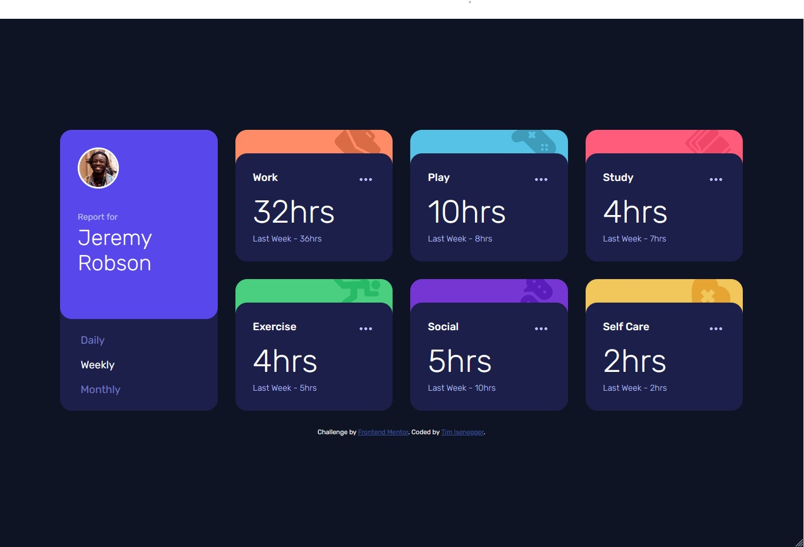

# Frontend Mentor - Time tracking dashboard solution

This is a solution to the [Time tracking dashboard challenge on Frontend Mentor](https://www.frontendmentor.io/challenges/time-tracking-dashboard-UIQ7167Jw). Frontend Mentor challenges help you improve your coding skills by building realistic projects. 

## Table of contents

- [Overview](#overview)
  - [The challenge](#the-challenge)
  - [Screenshot](#screenshot)
  - [Links](#links)
- [My process](#my-process)
  - [Built with](#built-with)
  - [What I learned](#what-i-learned)
  - [Continued development](#continued-development)
  - [Useful resources](#useful-resources)
- [Author](#author)

## Overview

### The challenge

Users should be able to:

- View the optimal layout for the site depending on their device's screen size
- See hover states for all interactive elements on the page
- Switch between viewing Daily, Weekly, and Monthly stats

### Screenshot



### Links

- Solution URL: [Vercel](https://challenge-time-tracking-dashboard.vercel.app/)

## My process

### Built with

- Semantic HTML5 markup
- CSS custom properties
- BEM notation
- Flexbox
- CSS Grid
- ES6
- Mobile-first workflow

### What I learned

**CSS Grids**

I have not yet used a lot of css grids, so this part was new to me:

```css
.card-grid {
  display: grid;
  grid-template-columns: repeat(2, 1fr);
  grid-template-rows: repeat(4, auto);
  column-gap: var(--spacer-large);
}
```

But I just love how easy you can create grids, and also add special styles for different grid-content, like this:
```css
.card--profile {
  grid-column: 1 / 2;
  grid-row: 1 / 3;
}
```

### Continued development

* Next time, I will still try and stick more to BEM as well as work on my wording (it still feels nooby)

### Useful resources

- [CSS Tricks - Guide to CSS Grid](https://css-tricks.com/snippets/css/complete-guide-grid/) - This is a great introduction to css grid, but also useful to look up anything regarding css grid.

## Author

- Website - [Timothy Isenegger](https://www.timothy-isenegger.ch)
- Frontend Mentor - [@timothy-isenegger](https://www.frontendmentor.io/profile/timothy-iseneggere)

